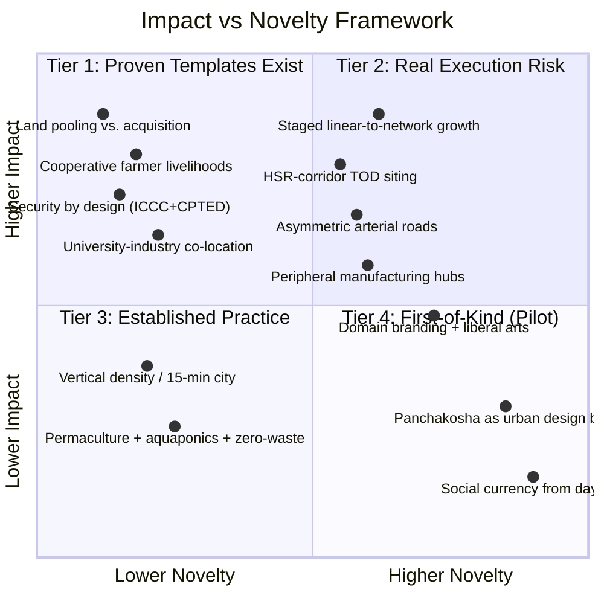
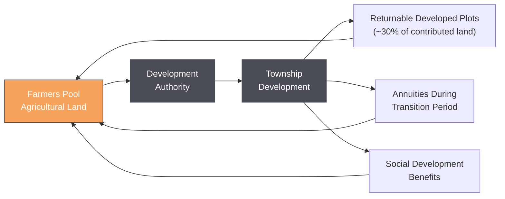
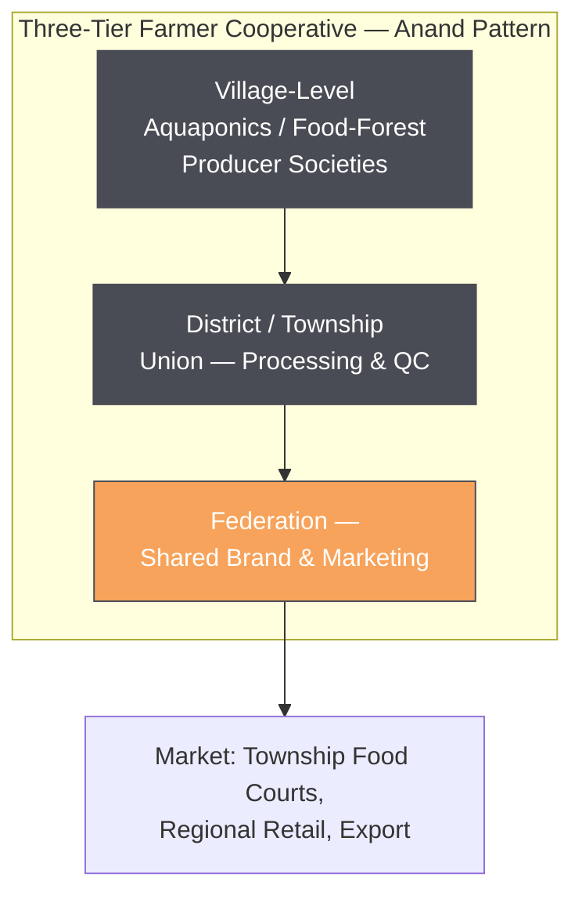
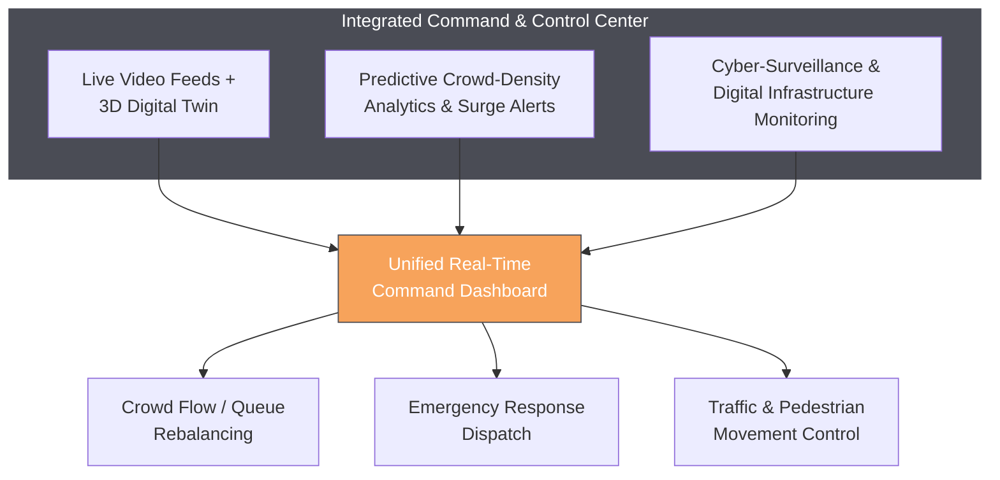
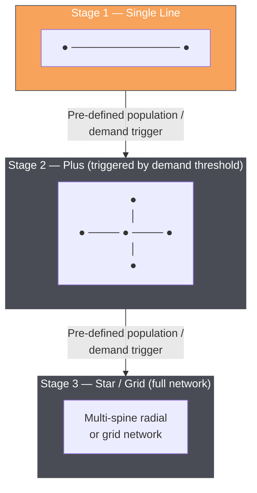
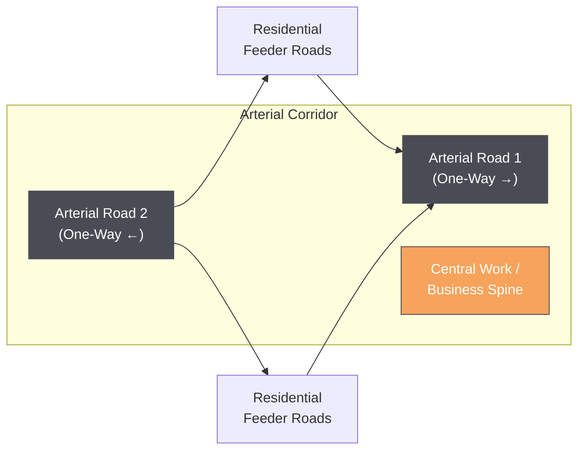
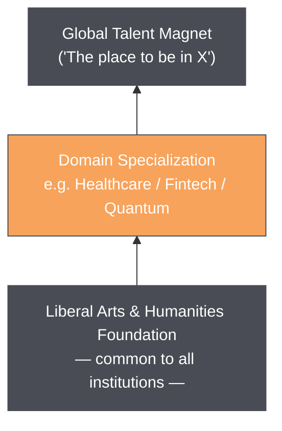
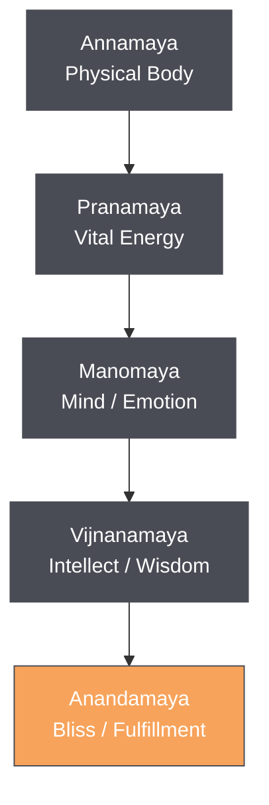

# Co-Located Educational Townships: A Design Framework and Literature Review

**Government of India Project — Educational Townships**
**Prepared for: Prof. Cmde. Pramod Kulkarni**

---

## Executive Summary

This document sets out a design framework for ~700-acre **co-located educational townships** — single-footprint developments that fuse universities, industry, R&D centers, and an innovation ecosystem, sited along high-speed rail corridors and built around a linear-city urban form, with explicit provisions for land acquisition, displaced-farmer livelihoods, security, and whole-person community design.

Sections are ordered first by **impact** — how much a section affects the project's social license to operate, its core viability, and the daily lived experience of residents — and within each impact tier, by **novelty**, flagging which ideas are well-precedented execution challenges versus genuinely new combinations with limited direct comparison.

**The two highest-impact sections are not the urban-form ideas that usually dominate township proposals — they are land acquisition and farmer livelihood transition, and security-by-design.** A 700-acre township cannot be built without first resolving how land is obtained and what happens to the people who farmed it; get this wrong, and no amount of clever urban design matters, because the project either doesn't get built or starts with a hostile, dispossessed population at its boundary. Likewise, once dense vertical infrastructure exists, security is not an add-on but a structural requirement from day one. Both areas turn out to have strong domestic precedent to draw on — Andhra Pradesh's Amaravati land pooling scheme, and the Tirumala Tirupati Devasthanams' AI-powered command center — making them simultaneously high-impact and comparatively low-novelty-risk, since working templates already exist in India.

The framework's most genuinely **novel** contributions — Panchakosha as an urban design brief, a community-wide social currency, and domain-branded townships with a mandatory liberal-arts substrate — carry real differentiation value but also the least precedent to lean on. The linear-city urban form sits in between: well-precedented in principle (TOD, Asian science cities, Soria y Mata's 1882 original) but carrying a live cautionary tale in NEOM's "The Line," which is being scaled back in real time as this document is written.

### Impact vs. Novelty Grid

The 13 design elements covered in this report, plotted against how much each affects project viability/social license (impact) and how much direct precedent exists to draw on (novelty):

| Quadrant | Elements | Reading |
|---|---|---|
| **Tier 1 — high impact, proven templates** | Land pooling, cooperative farmer livelihoods, security by design, university-industry co-location | These determine whether the project gets built and accepted at all. Strong Indian precedent exists for each (Amaravati, Amul, Tirumala ICCC, GIFT City) — the task is careful adaptation, not invention. |
| **Tier 2 — high impact, real execution risk** | Staged linear-to-network growth, HSR-corridor siting, arterial road geometry, peripheral manufacturing, domain branding + liberal arts | Sound principles with solid precedent in parts, but NEOM's live descoping shows the linear-city form is harder to execute at scale than to state, and the liberal-arts mandate has little direct township-scale precedent. |
| **Tier 3 — moderate impact, established practice** | Vertical density/15-minute city, permaculture + aquaponics + zero-waste | Shapes daily quality of life rather than core viability; each component is independently well-documented, mainly an execution-quality question. |
| **Tier 4 — first-of-kind, pilot before scaling** | Panchakosha as urban design brief, social currency from day one | Genuine differentiation value but the thinnest precedent of any element in this framework; both are recommended as phased pilots rather than day-one township-wide rollouts. |

---
## Table of Contents

- [Executive Summary](#executive-summary)
  - [Impact vs. Novelty Grid](#impact-vs-novelty-grid)
- [1. Land Acquisition and Farmer Livelihood Transition](#1-land-acquisition-and-farmer-livelihood-transition)
  - [1.1 Why This Has to Come First](#11-why-this-has-to-come-first)
- [5. Domain Branding and the Liberal Arts Substrate](#5-domain-branding-and-the-liberal-arts-substrate)
- [6. Sustainability, Density, and Quality of Life: Established Practice](#6-sustainability-density-and-quality-of-life-established-practice)
  - [6.1 Vertical Density and the 15-Minute City](#61-vertical-density-and-the-15-minute-city)
  - [6.2 Permaculture, Food Forests, and the Aquaponics Complement](#62-permaculture-food-forests-and-the-aquaponics-complement)
  - [6.3 Zero-Waste Formations](#63-zero-waste-formations)
  - [6.4 Energy](#64-energy)
  - [6.5 Hackerhouses and Reducing Household Chores](#65-hackerhouses-and-reducing-household-chores)
- [7. Whole-Person Development as an Urban Design Brief: The Panchakosha Lens](#7-whole-person-development-as-an-urban-design-brief-the-panchakosha-lens)
- [8. Social Currency: Design Principles and the Limits of Precedent](#8-social-currency-design-principles-and-the-limits-of-precedent)

---

## 1. Land Acquisition and Farmer Livelihood Transition

*Highest impact: this determines whether the project can be built at all, and whether it starts with a supportive or hostile surrounding population. Comparatively low novelty: India has two directly relevant, large-scale working precedents.*

### 1.1 Why This Has to Come First

A ~700-acre township sited along an HSR corridor will, in almost every plausible location, displace active farmland. Conventional compulsory land acquisition — compensation followed by displacement — has a long and difficult history in Indian infrastructure projects, generating exactly the kind of sustained local opposition that can delay or kill a project regardless of its architectural merit. The framework's land strategy therefore needs to be a **design decision**, not a legal afterthought, and needs to do two things simultaneously: acquire the land, and replace the income the land currently generates with something at least as good.

### 1.2 Land Pooling Instead of Acquisition

India already has a proven, large-scale alternative to compulsory acquisition: **voluntary land pooling**, in which farmers contribute land to a development authority and receive a mix of developed land, annuities, and social benefits in return, rather than a one-time cash payout.

The clearest precedent is Andhra Pradesh's **Amaravati Land Pooling Scheme**, used to assemble land for the state's new capital. The scheme covers a total city extent of about 217 square kilometers (roughly 54,000 acres), including about 15,000 acres of public land, and was designed so that landowners are not passive recipients of compensation but become direct beneficiaries of the city's development. In return for contributing their land, participating landowners receive returnable plots of urban land within the city perimeter — up to about 30% of the original land contributed — together with annuities and other social-development benefits; the aggregated expected value of these returnable plots, annuities, and benefits has been assessed as exceeding the replacement value of the agricultural land assets originally contributed. The scheme was the largest land-pooling exercise of its kind in India and was introduced through formal legislation, giving it a degree of legal robustness this framework can draw on directly.

A second, older precedent is Pune's **Magarpatta Township**, where 120 members of the Magar family pooled 430 acres of ancestral land to build a mixed-use township on the urban fringe, later designated a Special Economic Zone. Unlike Amaravati, Magarpatta was farmer-initiated rather than government-initiated — the landowners themselves formed a company and became developers, rather than handing land to an external authority — offering a second template in which farmers retain an even more active ownership stake. A comparative survey of landowner satisfaction across both projects (400 respondents in Amaravati, 100 in Magarpatta) found land pooling has emerged as a promising, cost-effective alternative to compulsory acquisition, sharing benefits with the stakeholders involved, with both schemes' dynamic plot-allocation and town-development mechanisms analyzed as workable models. Land pooling is also now in active use for Dholera Smart City (Gujarat) and parts of Delhi, and is recognized as voluntary, inclusive, and non-displacing, since landowners do not lose access to the area and gain higher land values from the infrastructure improvements the project itself brings, with no upfront compensation cost to government — though adoption nationally remains limited to a handful of states with the necessary enabling legislation, which the project will need to confirm or establish in its chosen state.

### 1.3 Replacing Farm Income, Not Just Farm Land: The Cooperative Precision-Agriculture Model

Land pooling solves the land question but not the livelihood question — a farmer who pools land for developed plots and annuities still needs an ongoing income, and the township's own design brief (minimizing footprint to reduce acquisition impact) means there is deliberately **less land available** to farm than before. The proposal's intent — replacing land-extensive traditional farming with land-light, high-value-per-acre methods, organized cooperatively rather than individually — has strong precedent on both halves.

**The cooperative ownership structure.** India's own dairy cooperative movement, the **Anand Pattern** behind Amul, demonstrates that smallholders can capture the high-value end of a supply chain rather than just the raw-production end. The model's defining feature is farmer control over the three stages *after* production — procurement, processing, and marketing — through a three-tier structure of village societies, district unions, and a state-level federation; unlike many cooperatives worldwide that end up as raw-material suppliers to a private company that controls the brand, the Anand Pattern retains end-to-end ownership of the value chain, so profits flow back to producers rather than to distant shareholders. The federation tier hires professional managers to run commercial operations while remaining democratically owned and governed by farmers at the base — over 3.6 million farmer-members today, organized through more than 185,000 village-level societies. This is the single most directly applicable governance template for the township's displaced farmers: rather than each household running an individual aquaponics or food-forest plot in isolation, the same village-society → union → federation structure can aggregate small producers into a single brand with shared processing, quality control, and marketing — capturing margin that would otherwise go to a middleman or aggregator.

**The land-light production technology.** Precision aquaponics and controlled-environment agriculture (CEA) make a credible income-per-acre case for the footprint reduction the project already wants. Aquaponics systems can yield up to 70% more produce per square meter than conventional soil-based farming, while using markedly less water; one Indian case study — Urbagrow Aquaponics in Kolkata — operates a 15,000-square-foot system yielding as much as a two-acre open fish pond, a roughly six-fold land-productivity improvement on a single crop type. Commercial aquaponics profitability estimates for 2025 range from about $20 to $50 in annual profit per square foot depending on system type, crop and fish selection, and market access, with well-optimized vertical/modular systems toward the higher end of that range — translating, even conservatively, into a far higher income-per-acre ceiling than open-field cultivation of the same crops, at the cost of higher upfront capital investment that the cooperative structure is well suited to pool and absorb collectively.

### 1.4 Integration with the Township's Own Food System

This land-light, cooperative agriculture model dovetails directly with two elements already in the framework: the **permaculture food forests** (Section 6.2) and the **communal food courts and mess-style dining** (Section 6 generally) can be supplied, at least in part, by the displaced-farmer cooperative itself, closing the loop between the people who lost agricultural land to the township and the people who now eat what the township's remaining green and aquaponics footprint produces. This also gives the cooperative a guaranteed local anchor customer in its early years, before it needs to compete in open regional markets — directly addressing one of the recurring failure modes in smallholder agri-cooperatives, which is reliable market access during the startup phase.

### 1.5 Open Questions Requiring Local Resolution

Land pooling and cooperative aquaponics are strong templates, not guarantees. Three things still need to be worked out locally and explicitly before land acquisition begins: (a) which state-level land-pooling legislation applies, since enabling law is not uniform across India; (b) the precise return ratio and annuity structure offered to farmers, calibrated against local land values rather than copied wholesale from Amaravati's terms; and (c) a transition-period income bridge for farmer-cooperative members between giving up their existing land and the new aquaponics/food-forest systems reaching commercial output, since CEA systems take time to commission and reach steady-state yield.

---

## 2. Security and Safety by Design

*High impact: dense vertical infrastructure housing students, faculty, families, and industry partners cannot be retrofitted for safety after the fact. Comparatively low novelty: India has an operational, large-scale reference system already running.*

### 2.1 Why Density Changes the Security Brief

The township's own urban-form choices — high-rise residential and work towers, communal dining, 24-hour mixed-use corridors, dense pedestrian flow along the central spine — multiply the consequence of any single security failure relative to a low-density campus. A fire, crowd-crush, or intrusion event in a high-density linear-spine township affects more people per incident than the same event would in a sprawling low-rise campus. Security therefore needs to be engineered into the urban form itself, not bolted on as a separate CCTV contract after construction.

### 2.2 The Operational Template Already Exists: Tirumala's Integrated Command and Control Center

The framework's own reference point — "video analytics like the system currently in Tirupati" — is, fortunately, one of the most advanced and well-documented systems of its kind anywhere in India, and it was stood up extremely quickly. The Tirumala Tirupati Devasthanams (TTD) commissioned an AI-powered **Integrated Command and Control Center (ICCC)**, realized in just 16 days from conception, to manage a site that receives daily pilgrim footfall ranging from 50,000 to as many as 1,000,000 devotees. The ICCC's scope spans real-time throughput visibility and slot optimization for visitor flow, queue management with waiting-time prediction and load balancing, and crowd management using density heatmaps and surge alerts, alongside accommodation-availability tracking, supply-chain/inventory visibility, and pedestrian and traffic movement management — equipped with a 10-meter video wall giving a unified real-time visual command view, and built to comply with national STQC and MEITY technical and security standards. The system was piloted during the Brahmotsavam festival and reached full-scale validation during Vaikunta Ekadasi, two of the highest-footfall events in the temple's calendar, giving it a stress-tested track record under genuinely extreme crowd conditions before being treated as a governance reference model.

The system's technical architecture is directly transferable: it consolidates live video feeds with a **3D digital twin** of the physical site, predictive crowd-density analytics, and cyber-surveillance for both physical safety and digital infrastructure resilience, delivered through a partnership model involving specialist video-analytics integrators and a major AI-hardware vendor. A stated operational goal — increasing the average time a visitor could safely spend at a single high-density choke point from roughly 1–3 seconds to a target of about 30 seconds, achieved specifically through better crowd-flow management rather than simply adding more security personnel — is a useful concrete benchmark for how this framework should think about its own busiest student/transit corridors and event spaces: the goal is not maximum surveillance coverage for its own sake, but **measurably smoother, safer flow** through the township's highest-density points.

### 2.3 Building Safety Into the Urban Form Itself, Not Just the Camera Network

Video analytics is one layer; the underlying physical design is the other, and has a much older evidence base. **Crime Prevention Through Environmental Design (CPTED)** — developed from the 1970s onward and validated across many subsequent audits — identifies natural surveillance (sightlines that let people see and be seen), territorial reinforcement (clear definition of public/private space through landscaping and entryway design), access control, and active, well-maintained "eyes on the street" activity as design-level alternatives or complements to camera-based monitoring. Documented field results are substantial where applied properly: one widely cited case found CPTED-based redesign cut recorded crime by 26% in a US neighborhood, while a California industrial park saw vandalism and break-ins halved and occupancy rise from 75% to 98% after lighting, access-control, and signage upgrades — without adding camera coverage. CPTED is most powerful, and least expensive, when applied at the planning stage rather than retrofitted, which aligns precisely with this project's greenfield status: the township's perpendicular residential-feeder roads, ground-floor activity-generating retail along the high-rise spine, and clear public/private zoning at building entrances are all CPTED-consistent choices already implicit in the urban-form sections of this framework, and should be made explicit design requirements rather than left as incidental side effects.

The literature also flags real trade-offs the framework should plan for rather than discover later: CPTED elements can work against each other (a security wall improves territoriality but can block the sightlines that enable natural surveillance), heavy reliance on camera-based "mechanical surveillance" can simply displace rather than reduce incidents to areas just outside camera coverage, and poorly considered designs can exclude or make vulnerable groups feel unwelcome rather than safe. A security plan that combines Tirumala's video-analytics layer with CPTED ground-floor and circulation design, reviewed jointly by planners, architects, and security professionals from the outset, addresses both layers rather than over-relying on cameras alone.

### 2.4 Privacy and Data-Protection Compliance — A Constraint, Not an Afterthought

A residential township is a fundamentally different legal context from a pilgrimage site, and this difference needs to shape the security design from the start. Video footage that identifies individuals, including through automatic number-plate recognition or facial-recognition technology, qualifies as personal data — and, where biometric identifiers are involved, as sensitive personal data — under India's **Digital Personal Data Protection (DPDP) Act, 2023**. Legal analysis of the Act's application to CCTV has flagged a genuine unresolved tension relevant to a township operating its own dense surveillance network: obtaining individual, purpose-specific consent in the manner the Act otherwise contemplates is not practically feasible in a high-footfall environment, and the Act does not yet provide a specific mechanism for CCTV-based consent, leaving prominent public signage at entry points as the most common practical workaround, alongside strict limits on retention and a hard rule against repurposing footage collected for one stated purpose (e.g., access control) toward a different one (e.g., behavioral analytics) without fresh consent. Separately, facial-recognition systems have documented accuracy gaps across gender, minority ethnic groups, and age extremes, which the township's system design and any vendor contract should explicitly test for and disclose, given that the resident population includes a deliberately wide age range under the all-ages-living-together design goal (Section 5). The practical implication for this framework: the security design should be paired from day one with a published data-retention policy, clear signage at every monitored zone, and a defined, narrow purpose for each data stream — treating DPDP compliance as a binding design constraint on the camera network's architecture, not a legal review to be conducted after the system is already specified.

---

## 3. The Linear City: Precedent, Failure Modes, and a Growth-Stage Response

*High impact: this is the township's core spatial organizing principle, and errors here are the most expensive to retrofit after construction. Moderate-to-high novelty: well-precedented in principle, but the live NEOM example shows the principle is far harder to execute at scale than it is to state.*

### 3.1 Origins and the Historical Record

The linear city is not a new idea — it is over 140 years old. Arturo Soria y Mata proposed it for Madrid in 1882, organizing residential and commercial development along a 500-meter-wide strip flanking a central tramway, with secondary perpendicular streets and an indefinite length. His goal was to replace the traditional idea of a city as a center with a periphery with the construction of linear infrastructure corridors along which other urban components could be attached, allowing controlled expansion that joins one city to the next rather than letting them sprawl. The layout consisted of large blocks with residential buildings surrounded by vegetation, with commercial and public structures concentrated at the intersections of the perpendicular streets — strikingly close to the perpendicular-road residential-feeder geometry proposed for this project.

The idea recurred throughout the twentieth century. Soviet planner N.A. Milyutin proposed a linear industrial-city model in the 1930s; Le Corbusier's *Ville Radieuse* drew explicitly on Soria y Mata; and the concept resurfaced in projects from the MARS Group's London plan to the Jersey Corridor project of the 1960s.

The historical verdict, however, is mixed. In Madrid's own Ciudad Lineal, the actual built outcome diverged from Soria's egalitarian intent: residential development increasingly took the form of gated complexes for affluent residents, alongside limited public services and commercial vitality along the axis, which restricted cross-class interaction and community cohesion. The pure ribbon form, lacking nodal hubs for organic social convergence, has been linked in subsequent analysis to isolated neighborhoods and monotonous daily experience, with travel distances for non-linear (cross-axis) journeys running several times longer than in compact cities of equivalent population — a direct empirical warning against treating "linear" as an unqualified virtue.

### 3.2 The Live Cautionary Tale: NEOM's "The Line"

The most important contemporary data point for this proposal is Saudi Arabia's NEOM "Line" project — and it is unfolding in real time. The Line was conceived as a 170-kilometer linear city with a population density of roughly 265,000 people per square kilometer, eliminating cars entirely and relying on AI-powered, renewable-energy infrastructure. As of mid-2026, the project is being substantially descoped. A strategic review found the linear city had been projected to cost over $1 trillion, and Saudi Arabia's sovereign wealth fund has now mandated that the scaled-down project generate real financial returns rather than simply consume capital. Reporting based on internal interviews indicates that engineers and executives struggled to realize the architectural ambitions handed down from leadership, with one planner noting that political direction called for dimensions far in excess of what technical guidance considered feasible. By 2026, Saudi priorities appear to be shifting away from The Line as a manifesto-city for millions of car-free residents and toward a more modest industrial and data-infrastructure hub.

Independent of execution issues, urban theorists have raised a structural objection: traditional cities evolved in circular and networked patterns because those patterns naturally optimize movement, accessibility, and social interaction, whereas a strict linear layout risks transportation bottlenecks and psychological monotony.

**Implication for this framework:** the proposal's own provision for growth — **single line → plus → star → grid** — is therefore not a cosmetic flexibility feature. It is the single design decision that most directly distinguishes this framework from NEOM's failure mode. A linear spine that is permitted, even expected, to grow into a networked form addresses both the historical isolation problem documented in Ciudad Lineal and the scale/cost-overrun problem now playing out at NEOM. The framework should treat the **plus/star/grid transition as a planned phase**, not an emergency pivot — triggered by population or demand thresholds defined in advance, rather than negotiated under pressure once the line is already built.

### 3.3 Transit-Oriented Development as the More Tested Foundation

A closely related but more empirically grounded body of practice is **transit-oriented development (TOD)** anchored to rail, which is directly relevant since this framework's "spine" is, in effect, a TOD corridor. Comparative work across Seoul and Tokyo's large-scale new towns found that both self-sufficiency and transit support were essential to successful outcomes, evaluated across density, diversity, design, distance to transit, destination accessibility, demand management, and demography. Critically, new towns in Copenhagen, Oslo, Paris, and Singapore in the twentieth century were planned and implemented around high-speed and rapid rail transit from the outset — supporting this project's instinct to site townships **on** HSR corridors rather than connect them after the fact. Within Tokyo's own development history, the state-owned rail operator in Tama New Town actually constructed the railway lines that private developers then used to provide transit service — i.e., the rail infrastructure preceded and shaped the urban form, the same sequencing this framework proposes.

### 3.4 Road Geometry and Vertical Density

The road geometry proposed — two flanking one-way arterials with perpendicular residential feeders, expandable to a second pair as the line grows — is, again, structurally close to Soria y Mata's original 1882 layout (Section 3.1), but applied with modern transit substituted for the tramway and an explicit zero-private-vehicle rule layered on top. The zero-car ambition itself mirrors The Line's stated design goal of housing residents without cars or streets, with essential facilities reachable within a five-minute walk — a goal that remains aspirationally sound even where NEOM's execution at extreme scale has faltered. Vertical density — high-speed elevators substituting for horizontal footprint — is the most tractable element of the original Line concept and the one least implicated in its current difficulties; it should be retained without the extreme height ambitions that contributed to NEOM's cost overruns. Vertical density also directly serves the land-acquisition goal of Section 1: a smaller built footprint per resident or worker means less agricultural land needs to be pooled or acquired in the first place.

### 3.5 Manufacturing at the Periphery

Positioning manufacturing hubs at the bifurcated ends of the spine, away from the residential/business core, has a clean precedent in Soria's own zoning logic: the linear city's original sector plan called for a segregated railway zone, a production-and-enterprise zone tied to scientific and technical institutions, a residential zone, and a park zone, with the city typically oriented so prevailing winds carried air from residential areas toward the industrial strip rather than the reverse. This framework's branch-line logistics design for manufacturing hubs is a direct modern descendant of that zoning principle.

---

## 4. Co-Location: The Well-Precedented Core

*High impact: this is the foundational premise of the entire project. Low novelty: extensively documented and already working in multiple Indian and international examples.*

### 4.1 The Teaching-Hospital Analogy and the Anchor-Institution Literature

The proposal's foundational analogy — that engineering/technology education should be built around industry the way medical education is built around teaching hospitals — restates, in different language, the dominant finding of the innovation-district literature: proximity between knowledge producers and knowledge users drives outcomes, provided the right kind of co-location occurs. A 2025 study of UK R&D co-location found a meaningful asymmetry: intra-industry R&D co-location showed little effect on innovative activity, whereas inter-industry co-location had positive effects, although these effects diminished as co-location intensity increased. This is a useful refinement for this framework: simply clustering "more R&D" is not sufficient — the productive co-location is specifically **cross-industry and cross-discipline**, which supports this framework's emphasis on universities, multiple industry types, and startups sharing one footprint rather than a single-industry science park.

### 4.2 Existing Examples, Domestic and International

The brief's own cited examples — Electronic City/IIIT Bangalore and RV University Mysore — sit within a much larger global pattern. Comparable US "innovation district" anchor-university models include St. Louis's **Cortex District**, a roughly 200-acre development that will include over 4.5 million square feet of office, lab, multifamily, and retail space at full buildout, formed as a partnership among BJC HealthCare, the Missouri Botanical Garden, St. Louis University, the University of Missouri–St. Louis, and Washington University, and Arizona State University's **SkySong**, a 42-acre site that will include more than 1.2 million square feet of commercial space at buildout alongside 325 luxury apartment units. Montreal's **District 3**, hosted inside Concordia University, is a smaller-scale but more tightly integrated example, operating as a startup accelerator and entrepreneurial community located within the university where students, alumni, and academic leaders share ideas and generate new products.

India's own closest analog to this entire framework, in terms of scale, state sponsorship, and the university-industry-finance mix, is **GIFT City** in Gandhinagar — a directly relevant domestic precedent worth foregrounding for an Indian government audience. GIFT City is located on the banks of the Sabarmati River, positioned to benefit from Ahmedabad's business hub and Gandhinagar's political capital, with seamless internal transportation and an international airport only about 20 kilometers away; it has since expanded to encompass an additional 3,300-acre land parcel. Its original footprint of 359 hectares (886 acres) was planned for roughly 110 buildings and 5.8 million square meters of built-up area, split roughly 67% commercial, 22% residential, and 11% social facilities, with the city designed explicitly around a walk-to-work concept — both the acreage and the walk-to-work design intent are close to this framework's own targets. GIFT City has also evolved into an education hub in its own right: it now sits within a knowledge corridor that includes IIT Gandhinagar, Deakin University, and the University of Wollongong, with nearby Ahmedabad and Gandhinagar contributing institutions such as IIM Ahmedabad, MICA, NID, NIFT, Nirma University, CEPT University, Gujarat Maritime University, and Gujarat National Law University. This demonstrates, within India's own regulatory and institutional context, that an integrated finance-tech-education township at this scale is achievable — and gives the project a closer operational template than any of the international examples discussed above.

---

## 5. Domain Branding and the Liberal-Arts Substrate

*Moderate-to-high impact: directly determines the township's ability to attract world-class talent, which is the project's stated success metric. Higher novelty: the branding strategy and liberal-arts mandate go further than most existing science-city analogs.*

The instinct that "each township should own a specific domain identity" has a recognizable lineage in **science city and anchor-institution** literature, though the explicit branding strategy ("if I want to work in healthcare, this is the place to be") goes a step further than most existing analogs articulate.

Innovation-district scholarship consistently finds that successful districts cluster around one or a small number of **anchor institutions**: the available literature generally holds that a successful innovation district needs at least one anchor firm or institution — typically a research university, another research-and-innovation-focused institution, or a large company — given the importance of innovation and information exchange between stakeholders. Domain-specific science cities make the case more starkly. South Korea's **Daedeok Innopolis**, established outside Daejeon from a 1967 plan, is now home to over 20 major research institutes and more than 40 corporate research centers, anchored by institutions including the Electronics and Telecommunications Research Institute and the Korea Aerospace Research Institute, with a high concentration of PhD researchers in applied sciences driving a wave of IT venture formation. Its identity is explicitly tied to a small number of strategic technology domains rather than general-purpose economic development. Japan's **Tsukuba Science City**, similarly, built its reputation as a world-class science and technology hub over decades of deliberate concentration, producing Nobel laureates among its achievements — i.e., the brand ("Tsukuba = serious basic research") emerged from sustained domain focus, not marketing.

The liberal-arts-as-substrate requirement is harder to find a direct international precedent for at the township scale; most science cities (Tsukuba, Daedeok) and most innovation districts in the Brookings/NAIOP literature are framed almost entirely around STEM and commercial output, with cultural and humanities infrastructure treated as an amenity rather than a curricular mandate. This makes the liberal-arts requirement one of this framework's genuine points of differentiation, not something importable wholesale from existing practice — it would need to be built and evaluated as a first-of-kind feature, most directly comparable to liberal-arts-core requirements in general higher education rather than to anything in the science-city literature.

---

## 6. Sustainability, Density, and Quality of Life: Established Practice

*Moderate impact: shapes daily quality of life and long-run resource resilience, but is largely an execution question rather than a viability question. Low novelty: each component has direct, documented precedent.*

### 6.1 Vertical Density and the 15-Minute City

The proposal's combination of vertical density with walking/cycling/transit-only mobility maps closely onto Carlos Moreno's widely adopted **15-minute city** concept, which envisions self-sufficient neighborhoods where residents can meet daily needs — living, commerce, work, education, entertainment, and healthcare — within a 15-minute walk or bike ride, reducing car dependency, curbing emissions, and revitalizing local economic activity. The model has moved from academic proposal to municipal policy: Paris adopted the concept as the central plank of Mayor Anne Hidalgo's 2020 re-election campaign, and the C40 Cities Climate Leadership Group recommended it as a key strategy for post-pandemic recovery. The framework's high-density work-zones-that-double-as-evening-social-space design is a direct application of 15-minute-city proximity principles to a greenfield context rather than a retrofit — arguably an easier setting in which to apply them, since there is no existing low-density fabric to overcome.

### 6.2 Permaculture, Food Forests, and the Aquaponics Complement

Food forests as a design category (rather than ornamental landscaping) are well documented at the scale of urban plots and parks, if not yet at township scale. Seattle's **Beacon Food Forest** offers a useful operational reference: the project began with a 7-acre design developed through a permaculture design course, of which 1.75 acres had been implemented after seven years, using a layout that maximizes the "edge" between zones — herb spirals doubling as seating, guild plantings circling around a central garden, edible hedges screening the site from street traffic, and curved rather than straight paths to multiply usable boundary. This is a useful caution for scale and pacing: even a relatively well-resourced and well-organized food-forest project achieved roughly a quarter of its target footprint within seven years, suggesting the township's permaculture ambitions should be planned with a multi-phase build-out timeline rather than assumed complete at occupancy.

The cooperative aquaponics system described in Section 1.3 should be read as a direct complement to, not a substitute for, the food forest — permaculture optimizes for ecological diversity and slow-maturing tree crops across the township's open green space, while aquaponics optimizes for fast-turnover protein and leafy-vegetable yield at high density on a much smaller dedicated footprint, with both systems feeding the same communal dining infrastructure.

### 6.3 Zero Waste by Design

Building zero-waste principles in from the start, rather than retrofitting waste management later, has precedent at the neighborhood level. Amsterdam's **Buiksloterham** district, redeveloped from former industrial land, was designed around an explicit set of circularity targets: near-100% circular material flow, near-complete resource recovery from wastewater, regenerated ecosystems with a self-renewing natural-capital base, maximally used infrastructure with zero-emission local mobility, and a diverse, inclusive socio-cultural environment alongside a strong local economy, formalized through a 2015 manifesto signed by roughly 20 stakeholders including local actors, organizations, associations, and companies — a useful governance template for how this framework's own zero-waste commitment might be formalized among the township's anchor institutions before construction begins. At national-policy scale, China's **Zero-Waste City** pilot offers evidence that the approach generalizes: a staggered rollout across 11 cities and 5 special zones in 2019, expanding to 113 prefectures by 2022, produced modest but robust and causally identified gains in urban ecological resilience, mediated through innovation, structural upgrading, and decarbonization, with the strongest effects in cities that had stronger implementation capacity — reinforcing that institutional capacity, not just design intent, determines whether zero-waste ambitions are realized.

### 6.4 Energy

Rooftop solar paired with dedicated, separately sited energy infrastructure for data centers and AI workloads has no single canonical case study in the literature surveyed here, but it follows directly from established microgrid and distributed-generation practice, and from the now-standard industry recognition that AI/data-center loads require dedicated, high-capacity power planning distinct from general building loads — visible in NEOM's own pivot, where a new agreement signed with a Saudi data-infrastructure and energy specialist was read by observers as a signal that priorities were shifting toward data-management infrastructure, underscoring that energy-hub planning for AI infrastructure is now treated as a distinct planning category even within projects originally conceived around other goals.

### 6.5 Hackerhouses and Reducing Household Chores

Hackerhouses enable like minded founders to stay and work together. It great not only for peer learning and mentoring, but creates an excellent support system.

By design, the township will have Mega community kitchens and Singapore style food courts to ensure that the citizens need to spend less time on cooking. They can get more time for growing their startups, life-long learning, hobbies, entertainment and rest. We can try other innovative solutions to reduce household chores. It will also make the township friendly for younger professionals.

---

## 7. Whole-Person Development as an Urban Design Brief: The Panchakosha Lens

*Moderate impact: shapes long-run community cohesion and resident wellbeing rather than near-term viability. High novelty: almost no precedent applies this framework at city scale.*

This is one of the most distinctive elements of the entire framework, and it has almost no precedent in international urban-planning literature applied at the scale of a city — though it has a developed and growing literature in Indian education policy.

The Panchakosha model derives from the Taittiriya Upanishad and describes five concentric layers of human existence: Annamaya (the physical body), Pranamaya (vital energy), Manomaya (mind and emotion), Vijnanamaya (intellect and wisdom), and Anandamaya (bliss), with the layers understood not as separate compartments but as interactive sheaths in which a disturbance in one ripples through the rest. India's National Education Policy 2020 has already adopted a version of this framework for curriculum design: NEP 2020 redefines the purpose of education around holistic development, experiential learning, and learner well-being, and the Panch Kosh framework provides an indigenous model mapping each of the five koshas to the policy's directives, demonstrated through sample timetables, teacher-training implications, and case studies.

What is novel in this proposal is the **lateral move from curriculum to urban form** — treating Panchakosha not as a syllabus design tool but as a checklist against which physical infrastructure, mobility design, food systems, and community governance are evaluated. The existing literature describes Panchakosha as a framework for individual development; this framework extends it to **community-level** design, asking whether the township as a whole — not just the school within it — supports all five layers.

| Kosha | Layer | Township Design Response |
|---|---|---|
| **Annamaya** | Physical body | Healthcare, recreation, walkable/cycle-friendly design, food forests, aquaponics-supplied nutrition |
| **Pranamaya** | Vital energy | Pollution-free mobility, green infrastructure, active living |
| **Manomaya** | Mind/emotion | Communal living, reduced chore-burden, cultural and social life, a security environment that feels safe rather than surveilled |
| **Vijnanamaya** | Intellect/wisdom | Liberal arts foundation, cross-disciplinary academic environment |
| **Anandamaya** | Bliss/fulfillment | Social currency for contribution, all-ages community, cultural thriving |

The risk flagged in the education literature applies equally here: one commentator warns against claiming adoption of "the Panchakosha system" while in practice only following a shallower four-part developmental model, cautioning that aspiring to Panchakosha should not be assumed equivalent to actually realizing it. Translated to this project: a township that simply lists healthcare, recreation, communal dining, and a liberal-arts curriculum as Panchakosha-aligned, without an integrated design process that treats the five layers as interdependent, risks the same superficial-labeling problem already identified in the schooling context. This applies directly to Section 2's security design: a heavy-handed surveillance environment that nourishes safety (Annamaya/Pranamaya) while damaging the sense of trust and unguarded community life (Manomaya) would be a Panchakosha failure even while technically reducing crime statistics — reinforcing why Section 2.3's CPTED-plus-camera balance, rather than camera-only design, matters for this framework's own stated values, not just for security best practice in isolation.

---

## 8. Social Currency: Design Principles and the Limits of Precedent

*Lower near-term impact: this affects community culture and long-run civic engagement rather than core viability, and can be introduced gradually without blocking other work. Highest novelty: the weakest direct precedent of any element in this framework.*

A community-wide social or complementary currency, implemented for every citizen from a township's founding, is the framework element with the **thinnest direct precedent** — most real-world complementary currencies have been retrofitted onto existing communities rather than designed in from a city's first day.

The broader category is well established. Community and complementary currencies include time-based credits, barter networks, and alternative tokens designed to strengthen local supply chains, retain wealth within a community, and support socially or ecologically desirable activity, generating a local multiplier effect and building networks of mutual aid. Concrete implementations exist at neighborhood and municipal scale: in Ghent, residents earned a currency called Torekes through community work, a design that rewarded contribution directly and was perceived as fair; in Maricá, Brazil, the **Mumbuca** currency built on experience from an earlier community currency, Banco Palmas, in Ceará, while the Basque Country developed its own currencies (Eusko, Ekhi, Txantxi) through new local institutional arrangements.

A systematic literature review on currency design offers a directly applicable design checklist: designing a community currency requires defining its purpose clearly — whether environmental sustainability, economic equity, or social inclusion — and revisiting the design principles regularly as the currency's purpose and characteristics evolve. A SWOT-AHP-based study of implementation strategy similarly recommends that any such system build social, economic, and political consensus first, establish a community-level observatory to monitor the system, define communication tools for financial-literacy education, and align the currency explicitly with the territory's broader sustainable-development strategy — none of which can be assumed automatic just because the currency launches alongside the township itself.

**Implication for this framework:** because no existing complementary-currency literature documents a system launched simultaneously with an entire new city of ~700 acres, the social-currency component should be treated as the framework's highest-uncertainty element, warranting a phased pilot (e.g., starting within the university/R&D community, or within the farmer cooperative described in Section 1.3, before extending township-wide) rather than a city-wide day-one rollout. The contribution-based design used in Ghent's Torekes is the closest available template for the "earned through contribution" model this framework specifies, rather than a flat universal-basic-income-style distribution.

---

## 9. Summary: Design Principles, Ranked by Impact Then Novelty

**Tier 1 — Highest impact, lower novelty (proven domestic templates exist; primary task is adaptation, not invention):**

1. **Land pooling instead of compulsory acquisition** — Amaravati and Magarpatta demonstrate this at scale in India; legal and ratio terms still need local calibration.
2. **Cooperative, land-light farmer livelihood transition** (Anand Pattern governance + precision aquaponics/CEA production) — Amul's three-tier model and documented aquaponics yield data both directly transferable; transition-period income bridging is the main open design question.
3. **Security and safety by design**, anchored on the Tirumala ICCC video-analytics model plus CPTED physical design — a stress-tested, India-based reference system already exists; DPDP Act compliance must be designed in from the start, not retrofitted.
4. **Co-location of university, industry, R&D, and startups** on one footprint — supported by a deep anchor-institution and innovation-district literature (Cortex, SkySong, District 3, GIFT City).

**Tier 2 — High impact, moderate-to-high novelty (sound principle, execution risk is real and partly unprecedented at this scale):**

5. **Linear-to-network growth staged against pre-defined triggers** — directly responsive to NEOM's real-time cautionary example; treats network expansion as planned, not reactive.
6. **Siting on HSR corridors with TOD principles** — directly supported by Tokyo, Seoul, Copenhagen, Oslo, Paris, and Singapore new-town precedent.
7. **Asymmetric one-way arterial roads with perpendicular residential feeders** — close descendant of Soria y Mata's 1882 zoning logic.
8. **Manufacturing at the periphery via bifurcated branch lines** — also traceable to the original linear-city sector model.
9. **Domain branding as an explicit strategic identity**, combined with a mandatory liberal-arts substrate — science cities (Tsukuba, Daedeok) achieve domain focus but rarely combine it with a humanities mandate.

**Tier 3 — Moderate impact, lower novelty (established practice; mainly an execution-quality question):**

10. **Vertical density and 15-minute-city mobility** — Moreno's 15-minute city is now mainstream municipal policy (Paris, C40 network); also reduces the land-acquisition footprint per Section 1.
11. **Permaculture food forests and aquaponics-complemented zero-waste design from inception** — precedented at neighborhood scale (Beacon Food Forest, Buiksloterham, China's Zero-Waste City pilot, Urbagrow Kolkata); township-scale implementation will require a multi-phase build-out plan.

**Tier 4 — Moderate-to-lower near-term impact, highest novelty (genuine first-of-kind elements; pilot before scaling):**

12. **Panchakosha as an urban design brief**, not just a curriculum tool — extending an individual-development framework to community-scale physical planning.
13. **Social currency implemented for every citizen from day one** — no documented precedent for a currency launched simultaneously with an entire new city; recommend phased pilot, possibly starting with the farmer cooperative itself.

---

## References

1. International Journal of Engineering Research & Technology (IJERT). Land Pooling Practices in India – A Case Study of Amaravathi and Magarpatta. https://www.ijert.org/research/land-pooling-practices-in-india-a-case-study-of-amaravathi-and-magarpatta-IJERTV11IS110115.pdf
2. Springer Nature Link. Innovative and Inclusive Land Pooling Scheme for the Planning of Amravati and Participant's Satisfaction. https://link.springer.com/chapter/10.1007/978-981-19-2386-9_2
3. ResearchGate. (2018). Land Pooling Scheme of Andhra Pradesh in Capital City Area — An Innovative Alternative to Land Acquisition Problems. https://www.researchgate.net/publication/323772151
4. OICRF. Innovative and inclusive land pooling scheme for developing a sustainable new capital city in Andhra Pradesh (Amaravati), India. https://www.oicrf.org/-/innovative-and-inclusive-land-pooling-scheme-for-developing-a-sustainable-new-capital-city-in-andhra-pradesh-amaravati-india
5. Rau's IAS. Land Pooling System (LPS) — Benefits and Challenges. https://compass.rauias.com/economy/land-pooling-system/
6. Agriculture.Institute. (2026). AMUL: A Model of Cooperative Success in Dairy Industry. https://agriculture.institute/cooperative-and-farmers-organizations/amul-cooperative-success-dairy-industry/
7. Agriculture.Institute. (2025). The Amul Model: Transforming Dairy Cooperatives in India. https://agriculture.institute/cooperative-and-farmers-organizations/amul-model-transforming-dairy-cooperatives-india/
8. Amul. A note on the achievements of the dairy cooperatives. https://amul.com/m/a-note-on-the-achievements-of-the-dairy-cooperatives
9. Arthnova. (2026). How Amul's Farmer-Owned Model Built a ₹72,000 Crore Dairy Empire. https://arthnova.com/amul-cooperative-model-72000-crore-dairy-empire/
10. Farmonaut. (2025). Aquaponics: Real Data & Advantages Over Traditional & Hydroponics. https://farmonaut.com/blogs/aquaponics-real-data-advantages-over-traditional-hydroponics
11. Future Fresh Farms. (2025). Aquaponics vs. Traditional Farming: A Comparative Analysis. https://futurefreshfarms.com/aquaponics-vs-traditional-farming/
12. Farmonaut. (2025). Aquaponics Profit Per Square Foot & Aquaponic Grants. https://farmonaut.com/blogs/aquaponics-profit-per-square-foot-aquaponic-grants
13. Current Agriculture Research Journal. Aquaponics Advancements: A Comprehensive Exploration of Sustainable Aqua-Agriculture Practices in the Indian Context. https://www.agriculturejournal.org/volume12number3/aquaponics-advancements-a-comprehensive-exploration-of-sustainable-aqua-agriculture-practices-in-the-indian-context/
14. Deccan Chronicle. (2026). AI-powered Command Control Centre in Tirumala Becomes Reference Model for Temple Governance: TTD. https://www.deccanchronicle.com/amp/southern-states/andhra-pradesh/ai-powered-command-control-centre-in-tirumala-becomes-reference-model-for-temple-governance-ttd-1935158
15. Scanalitix. (2025). Tirupati ICCC: A Smart Leap for a Pilgrim City. https://scanalitix.com/tirupati-iccc-a-smart-leap-for-a-pilgrim-city/
16. AV Today Magazine. (2025). Sri Venkateswara Swamy Temple Launches India's First AI-Powered Temple Command Centre. https://avtodaymag.com/tirupati-ai-powered-command-centre-ttd-iccc-crowd-management/
17. Deccan Herald. (2025). TTD sets up India's first AI-powered pilgrim integrated command & control center. https://www.deccanherald.com/amp/story/india%2Fandhra-pradesh%2Fttd-sets-up-indias-first-ai-powered-pilgrim-integrated-command-control-center-3742888
18. Seattle City Auditor. Crime Prevention Through Environmental Design (CPTED) Summary. https://www.seattle.gov/documents/departments/cityauditor/cpted.pdf
19. PMC. Exploring and developing crime prevention through environmental design (CPTED) audits: an iterative process. https://pmc.ncbi.nlm.nih.gov/articles/PMC9799677/
20. Reliance Foundry. (2025). What Is CPTED? Crime Prevention Through Environmental Design Explained. https://www.reliance-foundry.com/blog/what-is-cpted-crime-prevention-design
21. Software Freedom Law Center, India. Analysis of the Facial Recognition Technology-enabled Surveillance Landscape in India. https://sflc.in/analysis-of-the-facial-recognition-technology-enabled-surveillance-landscape-in-india/
22. Law.asia. (2026). Facial recognition and India's DPDP Act. https://law.asia/facial-recognition-compliance/
23. MediaNama. (2025). Can The DPDP Act Protect Citizens from CCTV Surveillance? https://www.medianama.com/2025/11/223-dpdp-act-citizens-cctv-surveillance/
24. SS Rana & Co. (2025). Peeping in through CCTV Surveillance: A Threat to Right to Privacy. https://ssrana.in/articles/peeping-in-through-cctv-surveillance-a-threat-to-right-to-privacy/
25. Moffat, J. (2025). The effect of R&D co-location on innovation activities in Great Britain. *Regional Studies*, Article 2496416. https://www.tandfonline.com/doi/full/10.1080/00343404.2025.2496416
26. NAIOP Research Foundation. *Case Studies in Innovation District Planning and Development*. https://www.naiop.org/globalassets/research-and-publications/report/case-studies-in-innovation-district-planning-and-development/researchreportcase-studies-in-innovation-district-planning-and-development-report.pdf
27. Innovation Area Development Partnership (IADP). (2020). The university as a catalyst in innovation district development. https://iadp.co/2018/09/03/the-university-as-a-catalyst-in-innovation-district-development/
28. District 3 Innovation Centre. Wikipedia. https://en.wikipedia.org/wiki/District_3_Innovation_Centre
29. World Economic Forum. GIFT City. https://www.weforum.org/organizations/gift-city/
30. GIFT Gujarat. Talent Ecosystem. https://giftgujarat.in/talent-ecosystem
31. Foreign Universities in GIFT City. https://api.giftgujarat.in/public/downloads/ifsc/Foreign-Universities-in-GIFT-City.pdf
32. SlideShare. Gujarat International Finance Tech City (GIFT). https://www.slideshare.net/slideshow/gujarat-international-finance-tech-city-gift-249671664/249671664
33. Wikipedia. Arturo Soria y Mata. https://en.wikipedia.org/wiki/Arturo_Soria_y_Mata
34. Wikipedia. Linear city (Soria design). https://en.wikipedia.org/wiki/Linear_city_(Soria_design)
35. Domus. (2026). The Line beyond 2030: Neom's flagship project shifts direction. https://www.domusweb.it/en/news/2026/05/27/the-line-postponed-beyond-2030-neom-saudi-arabia.html
36. CNBC. (2025). Saudi Arabia's 'The Line' at Neom is reviewed as it considers its megaprojects. https://www.cnbc.com/2025/07/18/saudi-arabias-the-line-at-neom-is-reviewed-as-it-considers-its-megaprojects.html
37. Fast Company. (2026). End of 'The Line': A timeline of Saudi Arabia's failed rendering city. https://www.fastcompany.com/91548713/the-line-neom-saudi-arabia-timeline-end
38. ScienceDirect. Evaluating transit-oriented new town development: Insights from Seoul and Tokyo. https://www.sciencedirect.com/science/article/abs/pii/S0197397523002564
39. ScienceDirect. Transit-oriented development with urban sprawl? Four phases of urban growth and policy intervention in Tokyo. https://www.sciencedirect.com/science/article/abs/pii/S0264837721005779
40. Asano, S. (1981). Tsukuba Science City: Japan Tries Planned Innovation. *Science*, 212(4500), 1239–1247. https://www.science.org/doi/abs/10.1126/science.212.4500.1239
41. Wikipedia. Daedeok Innopolis. https://en.wikipedia.org/wiki/Daedeok_Innopolis
42. ScienceDirect. (2022). The 15-minute city: Urban planning and design efforts toward creating sustainable neighborhoods. https://www.sciencedirect.com/science/article/abs/pii/S0264275122005406
43. Tenth Acre Farm. Two Examples: Using Permaculture in City Spaces with Urban Food Forests. https://www.tenthacrefarm.com/urban-food-forests/
44. ResearchGate. (2025). The circular economy in urban projects: A case study analysis of current practices and tools. https://www.researchgate.net/publication/353768660
45. Frontiers in Environmental Science. (2026). Can Zero-Waste City construction enhance urban ecological resilience? Evidence from China's pilot policy. https://www.frontiersin.org/journals/environmental-science/articles/10.3389/fenvs.2026.1859673/full
46. ShodhKosh: Journal of Visual and Performing Arts. (2024). Panch Kosh in Practice: Realizing NEP 2020's Vision of Holistic and Experiential Learning. https://www.granthaalayahpublication.org/Arts-Journal/ShodhKosh/article/view/6446
47. Krishnaswamy, A. (2025). Panchakosha Vikaas. *Medium*. https://a9a9d.medium.com/panchakosha-vikaas-19f56359f8a0
48. Nature Index. Community Currencies and Local Economic Systems. https://www.nature.com/nature-index/topics/l4/community-currencies-and-local-economic-systems
49. Springer Nature Link. (2024). Design principles for sustainable community currency projects. *Sustainability Science*. https://link.springer.com/article/10.1007/s11625-023-01456-4
50. Regenerative Economics Textbook. 6.3.4 Local strategies: Designing complementary currencies. https://www.regenerativeeconomics.earth/regenerative-economics-textbook/6-money-and-finance/6-3-regenerative-money-and-finance/6-3-4-local-strategies-designing-complementary-currencies

---

*Note on method: This review draws on web-search-accessible academic literature, industry reports, and recent news coverage current to June 2026, prioritized for relevance to a ~700-acre Indian educational-township brief. It is not a substitute for a systematic peer-reviewed literature review and should be supplemented with primary planning documents from the cited precedents (Amaravati LPS, Tirumala ICCC, GIFT City, Tsukuba, Daedeok in particular) before detailed design work begins. Sections are ordered by impact-then-novelty per the brief's request; this ordering reflects an editorial judgment about project risk and is intended as a starting point for discussion, not a definitive ranking.*
