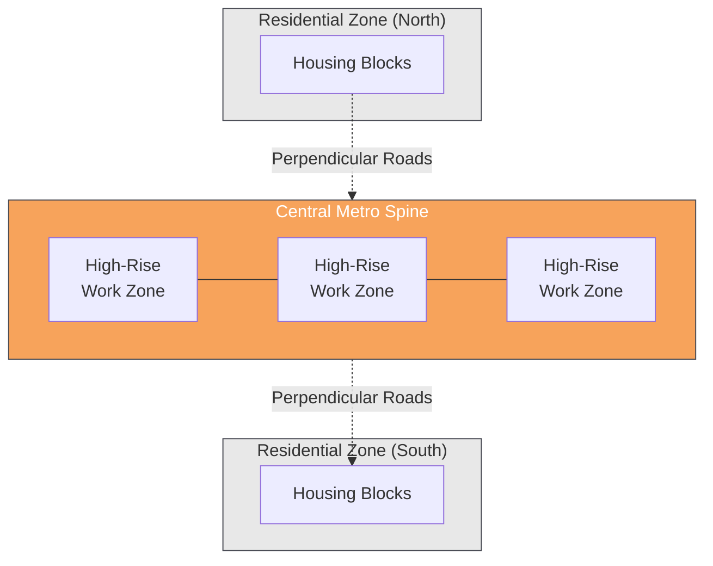
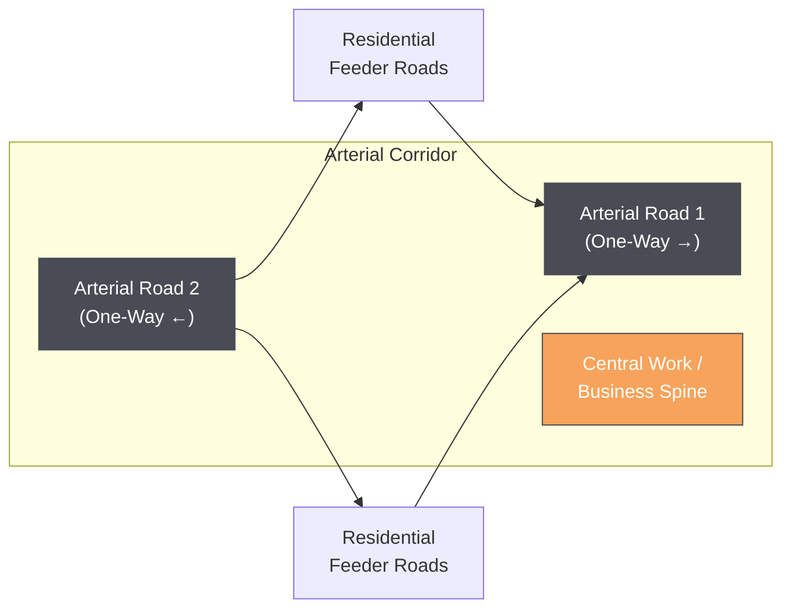
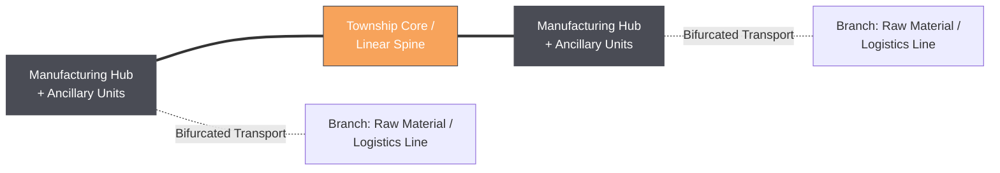
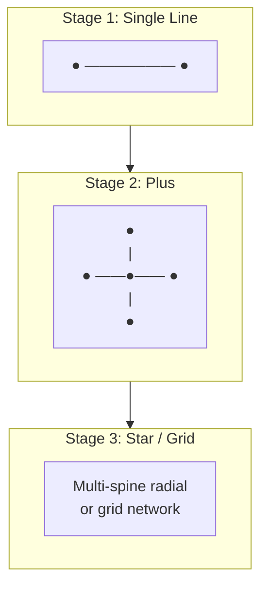
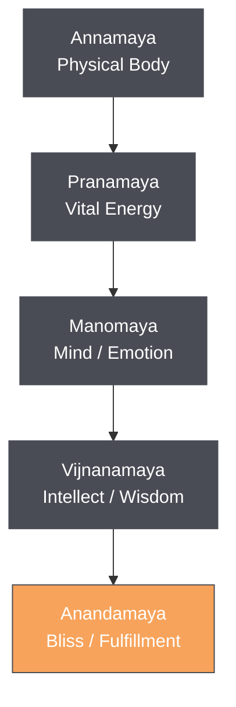
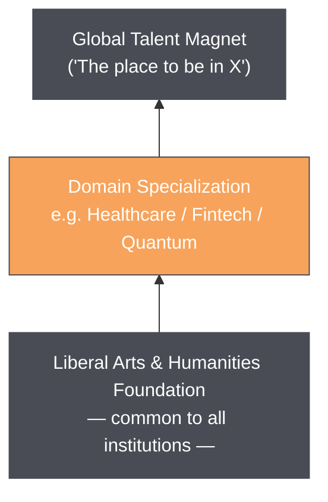

# Co-Located Educational Townships: A Design Framework

**Government of India Project — Educational Townships**
**Prepared for: Prof. Cmde. Pramod Kulkarni**

---

## 1. Project Overview

| Parameter | Detail |
|---|---|
| **Target scale** | ~700 acres per township |
| **Core model** | Universities, industries, R&D centers, and innovation ecosystem co-located on a single campus footprint |
| **Underlying premise** | Physical proximity between learning, research, and production accelerates all three |

---

## 2. Why Co-Location Works

### 2.1 The Teaching Hospital Analogy

Medical education offers the template: medical colleges are built around teaching hospitals, not beside them. Professors of practice move fluidly between the classroom and the ward; clinical research and product development happen in the same buildings where students train. The same model — practitioner-faculty, joint research, and product development under one roof — can be extended to engineering, technology, and other applied disciplines.

### 2.2 Proof of Concept Already Exists

| Example | What It Demonstrates |
|---|---|
| **Electronic City, Bangalore** | IIIT Bangalore sits directly opposite the Infosys main gate. The pairing organically attracted 4–5 more educational institutions to the same corridor. |
| **RV University, Mysore** | Located inside the Nanjangud industrial estate, embedding the campus within an existing manufacturing ecosystem rather than isolating it. |

These are not greenfield experiments — they are existing, working examples that this framework formalizes and scales.

---

## 3. Urban Design and Mobility

### 3.1 Regional Connectivity

- Every township connects to a **major metro hub** (e.g., Bangalore) and an **international airport** within a few hours via **high-speed rail**.
- Township locations are chosen **along existing or planned high-speed rail corridors** linking major metro cities — the township is sited on the line, not built in isolation and connected later.
- The township is conceived as a **functional extension of the metro/high-speed rail network beyond the airport** — i.e., airport access is structurally built into the transit spine, not an add-on.

### 3.2 The Linear City Model

The township is organized as a **linear city** along a central metro spine:

- **High-rise, high-density work zones** line the spine. These same buildings double as **social and business spaces in the evenings**, so the same capital investment serves both day and night economies — no separate "downtown" and "office park" needing duplicate infrastructure.
- **Residential areas** are arranged around the central business spine, with **perpendicular roads** providing residential-to-spine connectivity.

### 3.3 Pollution-Free Movement

Movement within the township is restricted to:

1. **Walking**
2. **Bicycle**
3. **Local electric bus** (drawing from an overhead supply line — minimal battery dependency)
4. **Metro**

No private fossil-fuel vehicles operate inside the township boundary.

### 3.4 Road Geometry — Minimal Crossings by Design

The road network is deliberately asymmetric to eliminate cross-traffic conflict:

- **Two one-way arterial roads** flank the central work spine (one in each direction), so traffic on the main corridor never needs to cross itself.
- **Internal residential roads** run in both directions, but only to **feed traffic onto the two arterial roads** — they are not through-routes.
- A **second pair of one-way roads** (running opposite to the first pair) can be added as the township grows, multiplying capacity without adding crossings.

### 3.5 Growth Configurations

A township is not capped at a single line. As demand grows, the linear spine can extend into:

- **Plus (+) configuration** — a second spine crossing the first
- **Star configuration** — multiple spines radiating from a central node
- **Grid configuration** — full network of intersecting spines

**Manufacturing hubs** are positioned at the **far ends of the linear spine** (away from the city core), where the line can **bifurcate** into separate transport branches. These branch ends carry dedicated energy, water, and raw-material logistics support, allowing them to host **ancillary industrial unit clusters** without burdening the township's residential and business core.

### 3.6 Vertical Growth Over Horizontal Sprawl

Both business and residential zones prioritize **vertical growth**:

- High-speed elevators and escalators keep every destination **minutes away** regardless of building height.
- Vertical density **reduces the township's overall land footprint**, preserving land for green cover, food forests, and future expansion rather than low-rise sprawl.

---

## 4. Sustainability and Quality of Life

### 4.1 Energy

- **Rooftop solar** covers air-conditioning load and contributes to local generation, reducing dependency on long-distance transmission.
- **Dedicated energy hubs**, sited beyond the road corridors, are reserved specifically for **data centers and AI infrastructure** — keeping high-load digital infrastructure separate from residential/business power demand.

### 4.2 Freeing Time from Household Chores

- **Communal food courts and mess-style dining** reduce the daily burden of individual cooking and cleanup.
- Time recovered this way is redirected toward **work, learning, hobbies, sports, entertainment, and rest** — treated as a deliberate design goal, not an incidental benefit.

### 4.3 Permaculture, Not Ornamental Horticulture

All greenery is planned as **permaculture food forests** — diverse, local tree and vegetation species selected for ecological function and food yield, not decorative landscaping alone.

### 4.4 Full On-Site Services

Every township includes, from day one:

- Healthcare
- Elder care
- Crèches
- Recreation facilities

Designed so that **all age groups live and play together**, rather than segregating by life stage.

### 4.5 Zero-Waste by Design

Garbage minimization is a **founding design constraint**, not a retrofit — addressed at the point of urban planning rather than through downstream waste management systems.

### 4.6 Community, Culture, and Social Currency

- The township is designed to be a **thriving cultural hub** with genuine community life, not just a residential-and-work facility.
- A **social currency system** — earned through contribution to the community — is implemented **from the township's inception** for every citizen, embedding civic participation into daily life from day one.

### 4.7 Whole-Person Development — The Panchakosha Lens

The township is designed to support development across **all five Panchakosha levels** — for both the individual and the community as a whole:

| Kosha | Layer | Township Design Response |
|---|---|---|
| **Annamaya** | Physical body | Healthcare, recreation, walkable/cycle-friendly design, food forests |
| **Pranamaya** | Vital energy | Pollution-free mobility, green infrastructure, active living |
| **Manomaya** | Mind/emotion | Communal living, reduced chore-burden, cultural and social life |
| **Vijnanamaya** | Intellect/wisdom | Liberal arts foundation, cross-disciplinary academic environment |
| **Anandamaya** | Bliss/fulfillment | Social currency for contribution, all-ages community, cultural thriving |

---

## 5. Specializations Within a Holistic Foundation

### 5.1 Domain Branding — Not Just Infrastructure

Each township should own a **specific domain identity**, not merely offer generic good infrastructure:

- Select a niche — healthcare, fintech, quantum computing, or similar — and build the township's reputation around attracting the **world's best practitioners in that field**.
- **Target outcome:** "If I want to work in healthcare, *this* is the place in the world to be."

### 5.2 Liberal Foundation, Specialized Peak

| Layer | Description |
|---|---|
| **Foundation (non-negotiable, every institution)** | Liberal arts and humanities, taught across *all* disciplines — engineering, medicine, technology — so the township functions as a genuine cultural and intellectual hub, not a single-purpose campus. |
| **Specialization (domain brand)** | One sharply defined niche per township, pursued to world-leading depth. |

This dual structure means a quantum-computing township, for instance, still produces graduates and residents with a full liberal education — the specialization sits **on top of**, not **instead of**, a holistic base.

### 5.3 International-Grade Quality of Life

Retention of global talent depends on quality of life matching or exceeding international benchmarks — this is treated as a **prerequisite for the domain-branding strategy to work**, not a separate amenity layer.

---

## 6. Summary: Design Principles at a Glance

1. **Co-locate, don't connect later** — university, industry, R&D, and startups share one footprint from inception.
2. **Build on the rail line, not near it** — siting follows high-speed rail corridors between metro cities.
3. **Linear-to-network growth** — start as a line, scale to plus/star/grid as demand grows.
4. **Vertical density, minimal footprint** — elevators and escalators substitute for horizontal sprawl.
5. **Zero private vehicles inside the township** — walk, cycle, e-bus, or metro only.
6. **Asymmetric roads eliminate crossings** — one-way arterial pairs flank the work spine.
7. **Manufacturing at the periphery, not the core** — bifurcated branch lines carry industrial loads away from the residential/business spine.
8. **Design for whole-person flourishing** — Panchakosha-aligned, social-currency-enabled, permaculture-based, zero-waste-by-design.
9. **One brand, one niche, world-class** — every township is known for something specific.
10. **Liberal foundation under every specialization** — humanities and liberal arts are mandatory, not optional, across all institutions.
